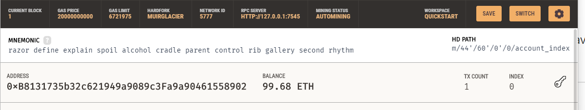
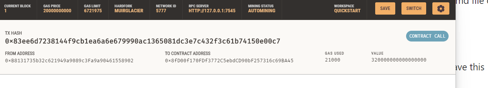
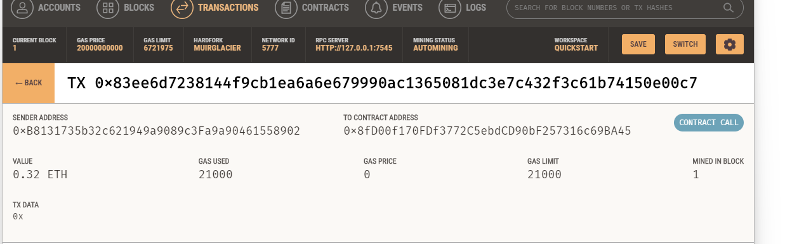
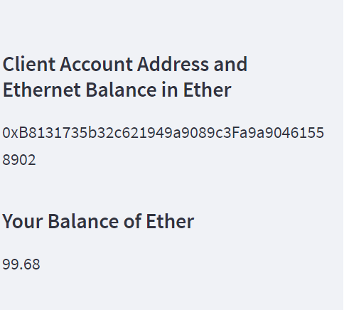

# blockchain-wallets

 In this assignment,  I generate a new Ethereum account instance by using the mnemonic seed phrase provided by Ganache, fetch and display the account balance associated with the Ethereum account address, calculate the total value of an Ethereum transaction, including the gas estimate, that pays a Fintech Finder candidate for their works, digitally sign a transaction that pays a Fintech Finder candidate, and send this transaction to the Ganache blockchain and review the transaction hash code associated with the validated blockchain transaction.

Screenshot of my address balance and history on Ganache:

Screenshot of the transaction details on Ganache:

Screenshot of the recipient’s address balance and history from Ganache:

Screenshot of the refreshed webpage:

